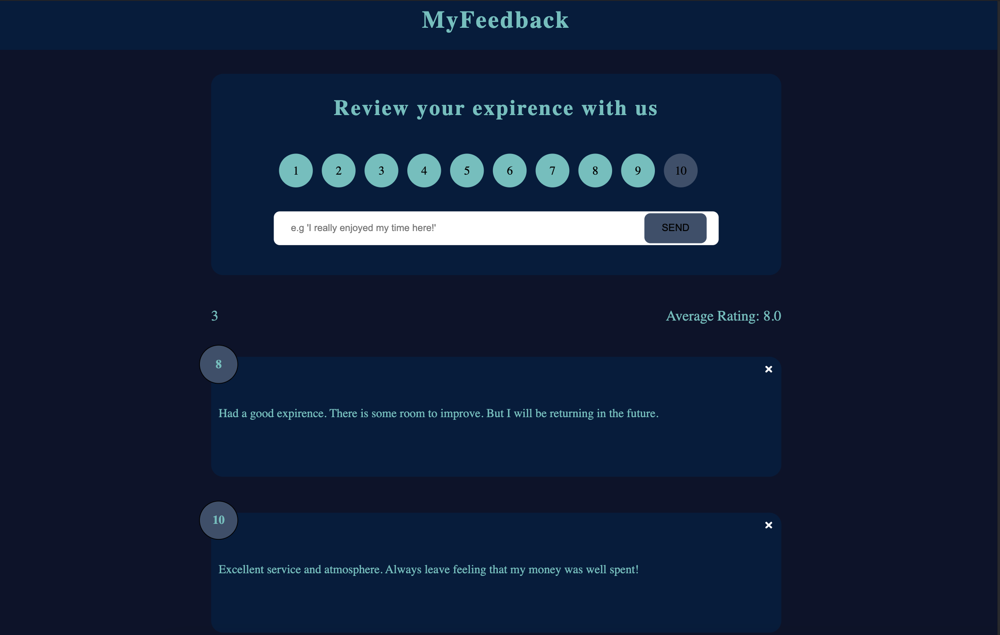

#  React Reedback Application

## Table of contents

- [Overview](#overview)
  - [The challenge](#the-challenge)
  - [Screenshot](#screenshot)
  - [Links](#links)
- [My process](#my-process)
  - [Built with](#built-with)
  - [What I learned](#what-i-learned)
- [Author](#author)

## Overview

### The challenge

Users should be able to:

- View the optimal layout for the game depending on their device's screen size
- See hover states for all interactive elements on the page
- Select rating and write a breif review on a product or service
- Delete previous reviews

### Screenshot

### Links

- Live Site URL: [Github Pages](https://danielheppenstiel.github.io/Tic-Tac-Toe-Game/)

## My process

### Built with

- Semantic HTML5 markup
- CSS custom properties
- Flexbox
- CSS Grid
- JavaScript
- React

### What I learned

This project was inspired by Brad Traversy's React Front to Back course. I used this project as an opportunity to get familiar with the basics of react. These include JSX, components, props, and state. 

## Author

- Website - [Daniel Heppenstiel](https://github.com/Danielheppenstiel)
- Frontend Mentor - [@Danielheppenstiel](https://www.frontendmentor.io/profile/Danielheppenstiel)
- Twitter - [@yDevWithDan](https://twitter.com/DevWithDan)
